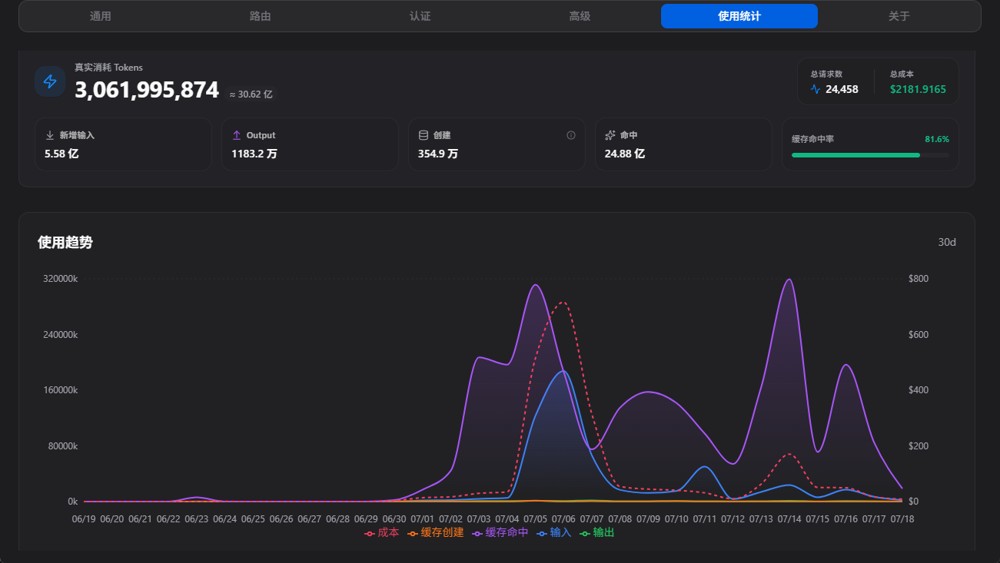

+++
date = '2026-07-18T16:36:38+08:00'
draft = true
title = 'CapOwn项目第一次复盘'
tags = ['AI']
categories = ['note']
description = ''
+++

在差不多半个月时间内烧了30亿token后，我仍然没能给出一套真正能使用的面向AI-AGENT的分布式能力网络管理平台的初版。

我想，现在应该先停下来，记录一下我存在哪些决策错误。

首先，是关于这个产品的定位没有尽早收束，我一直把worker节点的 “文件安全修改操作” 看成是一个核心功能。然而，在早期设想 CapOwn 产品名时，明明已经是有着把 Capability 这个概念作为产品的一个亮点。

所谓 “能力” 就应当意味着文件操作、沙盒管理、快照，这些功能应当是以插件形式引入，而不是作为worker节点的内置功能。

在与AI进行设计沟通时，我没能提出有效的质疑，从而听从了AI关于“worker节点不需要采用别人的模块，这会增加依赖负担，不如自己编写相关功能”的说法，如今看来，这是在沟通时，AI也默认我是打算内置这套功能，而不是以能力与插件的方式去设计这套系统，所导致的方向偏离。

worker内置功能的实现，浪费了我将近一周的时间，是该产品设计中的T0级决策失误。

第二点是在用户交互体验的设计上，我从一开始一直纠结于CLI的设计，对于client这个角色来说，CLI的设计是有必要的，因为这是AI-AGENT直接对接的一个节点。然而，对于master与worker的命令行交互，从一开始就想得过多，各种CLI的名称设计，甚至每个单词到底取什么，子命令是怎么衔接，这些问题，都在后来引入了dashboard后成了浪费我时间的一环。在做capown-next版本时，我才果断把大量无用的命令行交互去掉了，所有的配置就是应当集中到dashboard来进行管理，**这才是用户体验最好的一种方式**。

认清到一点就是，至少都在这个时代了，CLI应当是给AI的交互方式，人类理应至少享有GUI的交互，而不是还想着有极客会更愿意接受CLI的交互方式。

第三点是在通信协议的设计上，没能尽早按照标准 OPENAPI 协议规范进行制定，导致协议条款都仅落在代码本身和文档的简略概括中，使得next版本的构建多浪费了点时间。

另外就是在这个项目里，我才真正把短轮询、长轮询、SSE、Websocket这四种web连接方案的应用差异给理解了，而之前因为只想着找websocket的替代方案，也是只拉着ai讨论SSE的应用，而忽略了task传输需要有保险机制的问题。

说到底，和AI讨论方案还是容易忽略一些细节，它总是想着以最短路径解决我提出的问题，却没想到这条路本身就有问题。
