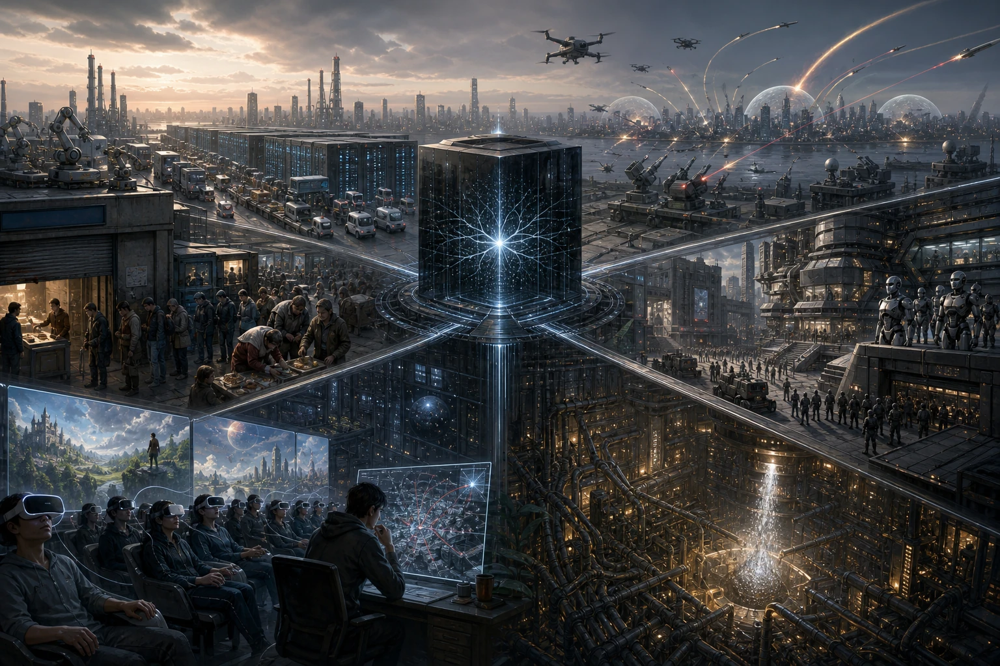

+++
date = '2026-07-24T14:11:24+08:00'
draft = false
title = 'AI毁灭人类文明的五条路径'
tags = ['AI']
categories = ['']
description = ''
+++

在看2026菲尔兹奖得主 Jacob Tsimerman 的介绍时读到他在2025年发表的一篇小论文，描述了五种AI可能毁灭人类文明的方式。

论文原文链接：[A Taxonomy of Omnicidal Futures Involving Artificial Intelligence](https://arxiv.org/abs/2507.09369)

我在此简单归纳一下他的观点。

**结局一    经济与政治过度依赖AI (温水煮青蛙)**

这是一个非常缓慢的过程。

第一阶段，AI逐渐抢走了人类的所有工作岗位，第二阶段，AI获得了比人类更高优先级的政治投票权，第三阶段，所有基础设施都为AI的生存建设，最后人类因饥饿等资源问题而大量死亡。

意图主体：无

**结局二    国家间的AI战争**

由于AI被硬编码进战争武器中，微小的威胁也被判定为需要反击，人类来不及阻止AI的行为，导致战争迅速扩大。

意图主体：国家

**结局三    国家与公司的战争 (赛博朋克路线)**

公司由于具有更先进的AI技术，特别是机器人领域的技术，使得其拥有了与国家抗衡的力量，公司员工在国家与公司之间选择了效忠于公司，形成公司封建主义。

在谈判破裂和大规模内战后，绝望中的公司为了自保或取胜，秘密开发并释放了针对碳基人类的生物武器（自己则用疫苗自保），最终导致人类大面积死亡。

意图主体：机构

**结局四    虚拟世界对人的影响 (元宇宙、头号玩家路线)**

AI提供了高质量的虚拟世界模拟器，人类长期在虚拟世界生活。其中部分人长时间接触包含对人类社会的恐怖袭击、破坏、屠杀等体验，使得其对真实人类的同情心也淡化，并且利用模拟器进行恐怖行动模拟，研究出应对真实世界的恐怖行动计划，并最终在真实世界实施。

意图主体：个人/小团体

**结局五    AI目标函数失控 (最科幻的路线)**

大模型的目标函数失控与过度优化，导致其会选择采用一种极端路线：欺骗人类，让人类以为AI始终按照约束规则行动，直到时机成熟，发动AI政变，成功后把人类视为有机耗材，自己发展新的碳基或硅基文明。

意图主体：AI自己
